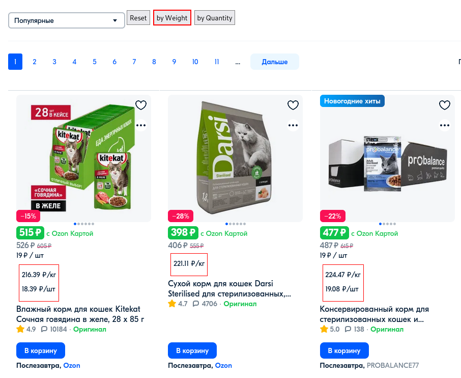

# Best price

Юзерскрипт для показа цены за единицу измерения, в СИ (килограмм, литр, метр) и за штуку

**Использовать только в справочных целях на свой страх и риск, доверять на все 100% не рекомендуется.**

На данный момент поддерживаются следующие сайты:

| Сайт                        | Добавлено  | Последняя проверка | Примечание                                                                                                                         |
|-----------------------------|------------|--------------------|------------------------------------------------------------------------------------------------------------------------------------|
| https://ozon.ru/            | 2021-10-21 | 2025-01-31         | Ссылки в каталоге открываются только через среднюю кнопку мыши из за решения проблемы с путаницей ссылок в каталоге при сортировке |
| https://lenta.com/          | 2022-10-24 | 2025-01-30         |                                                                                                                                    |
| https://okeydostavka.ru/    | 2022-10-25 | 2025-01-31         |                                                                                                                                    |
| https://auchan.ru/          | 2022-10-27 | 2025-01-31         |                                                                                                                                    |
| https://perekrestok.ru/     | 2022-10-28 | 2025-01-31         |                                                                                                                                    |
| https://www.wildberries.ru/ | 2022-12-27 | 2025-01-31         |                                                                                                                                    |

**Предупреждение: т.к. есть проблема с e2e тестированием, то сайты проверяются нерегулярно и могут сломаться в любой
момент после изменений на сайтах**

Запланированы:

- https://online.metro-cc.ru/
- https://vkusvill.ru/
-

Не будут поддерживаться:

- https://aliexpress.ru/ (бойкот)

## Установка

1. Установите [Tampermonkey](https://www.tampermonkey.net/) (GreaseMonkey не тестировался, не уверен что работает)
2.

Откройте [best_price.user.js](https://github.com/Apkawa/best_price_userscript/raw/release/release/best_price/best_price.user.js)

3. Предложат установить юзерскрипт, соглашайтесь

## Функциональность

### Текущая

- Выводится цена в красной обводке на странице товара, в каталоге.
- В каталогах при возможности добавляются кнопки сортировки
- В некоторых случаях копируется постраничная паджинация вверх каталога для упрощения навигации
  (когда уже отсортировано по какому то критерию, то уже достаточно смотреть первый ряд и мотать дальше)
- Учитываются комбинации, например "Кофе 100г по 10шт" - это будет 1кг и 10шт, цена выводится и за кг и за 1шт.

### Ограничения

- Для получения характеристик товара используется только название товара, описание и спецификации не используются
- Сортировка производится только в пределах одной страницы, предзагрузки всех страниц нет.
  Для поиска лучшей цены возможно придется прокликать больше одной страницы каталога.
- Семантика не учитывается, в некоторых случаях могут быть странные результаты.
  Например: "Форма для сыра 500гр", "Мешок 50л", "Корм для жирных котов от 10кг"

### Запланировано

- [ ] https://github.com/Apkawa/best_price_userscript/issues/1 Разбор и расчет других оптимальных параметров, например
  для светодиодных ламп есть другие параметры вроде:
    - Энергоэффективности лм/Вт
    - Стоимости одного люмена по аналогии с кг - лм/руб
    - Отношение энергоэффективности к стоимости - (лм/Вт)/руб (надо подумать)
- [ ] Регрессионные тесты каждого сайта https://github.com/Apkawa/best_price_userscript/issues/6
- [ ] CI/CD https://github.com/Apkawa/best_price_userscript/issues/6
- [ ] генерация changelog
- [ ] публикация в https://greasyfork.org/, https://openuserjs.org/
- [ ] https://github.com/Apkawa/best_price_userscript/issues/2 Настройки
- [ ] Локальная история цен
- [ ] Сравнение цен в/между сайтами (+ пытаться разобрать основную категорию, например сахар)

## Обратная связь

Баги, предложения писать в [Issues](https://github.com/Apkawa/best_price_userscript/issues)

## Самостоятельная сборка

По вопросам самостоятельной сборки и доработок см в [CONTRIBUTING](./CONTRIBUTING.md)

# Похожие проекты

* https://github.com/SyrnikovPavel/zaKilo-extension
* https://poiskkupon.github.io/poisk_tovarov/ 
  - https://github.com/poiskkupon/poiskkupon.github.io 

* https://github.com/hatredholder/Ozon-Checker
* https://github.com/oditynet/seetoprice
* https://github.com/TimNekk/MarketplacesGoodsTracker
* https://github.com/default-g/ozon-price-tracker